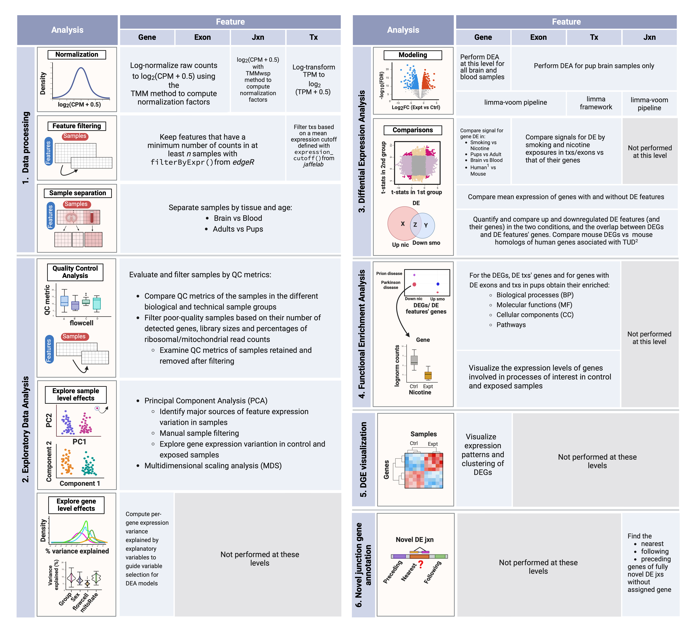

<!-- README.md is generated from README.Rmd. Please edit that file -->

# smokingMouse

<!-- badges: start -->

[](https://github.com/LieberInstitute/smokingMouse/issues)
[](https://github.com/LieberInstitute/smokingMouse/pulls)
[](https://lifecycle.r-lib.org/articles/stages.html#experimental)
[](https://bioconductor.org/checkResults/release/data-experiment-LATEST/smokingMouse)
[](https://bioconductor.org/checkResults/devel/data-experiment-LATEST/smokingMouse)
[](http://bioconductor.org/packages/stats/bioc/smokingMouse/)
[](https://support.bioconductor.org/tag/smokingMouse)
[](http://bioconductor.org/checkResults/devel/data-experiment-LATEST/smokingMouse/)
[](https://bioconductor.org/packages/release/bioc/html/smokingMouse.html#since)
[](https://github.com/LieberInstitute/smokingMouse/actions/workflows/check-bioc.yaml)

<!-- badges: end -->

Welcome to the `smokingMouse` project! Here you’ll be able to access the
mouse expression data used for the analysis of the
smoking-nicotine-mouse LIBD project.

## Overview

This bulk RNA-sequencing project consisted of a differential expression
analysis (DEA) involving 4 data types: genes, exons, transcripts and
exon-exon junctions. The main goal of this study was to explore the
effects of prenatal exposure to maternal smoking and nicotine exposures
on the developing mouse brain. As secondary objectives, this work
evaluated: 1) the affected genes by each exposure on the adult female
brain in order to compare offspring and adult results and 2) the effects
of smoking on adult blood and brain to search for overlapping biomarkers
in both tissues. Finally, DEGs identified in mice were compared against
previously published results in human (Semick, S.A. et al. (2018) and
Toikumo, S. et al. (2023)).

The next table summarizes the analyses done at each level.

<figure>

<figcaption style="color: gray; line-height: 0.94; text-align: justify">

<font size="-1.5"><b> Summary of analysis steps across gene expression
feature levels </b>:

<b>1. Data preparation</b>: in this first step, counts of genes, exons
and junctions were normalized to CPM and scaled; transcript expression
values were only scaled since they were already in TMP. Then,
low-expression features were removed using the indicated methods and
samples were separated by tissue and age in order to create subsets of
the data for downstream analyses.

<b>2. Exploratory Data Analysis</b>: QC metrics of the samples were
examined and used to filter them; sample level effects were explored
through dimensionality reduction methods and rare samples in PCA plots
were manually removed from the datasets; gene level effects were
evaluated with analyses of explanatory variables and variance partition.
<b>3. Differential Expression Analysis</b>: with the relevant variables
identified in the previous steps, the DEA was performed at the gene
level for nicotine and smoking, adult and pup, and blood and brain
samples, and for 3 models: the naive one modeled
<span style="font-family: monospace">~Group + batch effects</span>, the
adjusted model modeled <span style="font-family: monospace">~Group +
Pregnancy + batch effects</span> for adults and
<span style="font-family: monospace">~Group + Sex + batch effects</span>
for pups, and the interaction model
<span style="font-family: monospace">~Group\*Pregnancy + batch
effects</span> for adults and
<span style="font-family: monospace">~Group\*Sex + batch effects</span>
for pups; DEA on the rest of the levels was performed for pups only and
using the adjusted model. After that, signals of the features in
nicotine and smoking were compared, as well as the signals of exons and
txs vs the effects of their genes, and genes’ signals were additionally
compared in the different tissues, ages, models and species (vs human
data of a previous study). All resultant DEG and DE features (and their
genes) were quantified and compared based on their experiment (nic/smo)
and direction of regulation (up/down); DEG were further compared against
genes of DE exons and txs; mouse genes were also compared with human
genes affected by cigarette smoke or associated with TUD. <b>4. Gene
Ontology and KEGG</b>: taking the DEG and the genes of DE txs and exons,
GO & KEGG analyses were done and the expression levels of genes that
participate in brain development related processes were explored. <b>5.
DE feature visualization</b>: DEG counts were represented in heatmaps in
order to distinguish the groups of up and down-regulated genes. <b>6.
Junction annotation</b>: for novel DE jxns of unknown gene, their
nearest, preceding and following genes were determined.</font>

<font size="0.8">Abbreviations: Jxn: junction; Tx: transcript; CPM:
counts per million; TPM: transcripts per million; TMM: Trimmed Mean of
M-Values; TMMwsp: TMM with singleton pairing; EDA: exploratory data
analysis; QC: quality control; ribo: ribosomal; mt: mitochondrial; PCA:
Principal Component Analysis; PC: principal component; MDS:
Multidimensional Scaling; DEA: differential expression analysis; DE:
differential expression/differentially expressed; DEG: differentially
expressed genes; GO: Gene Ontology; KEGG: Kyoto Encyclopedia of Genes
and Genomes; TUD: tobacco use disorder.</font>

</figcaption>
</figure>

## Study design

<figure>

<figcaption style="color: gray; line-height: 0.88; text-align: justify">

<font size="-1.5"><b>Figure 1</b>: <b>Experimental design of the
study</b>. <b>A)</b> 36 pregnant dams and 35 non-pregnant female adult
mice were either administered nicotine by intraperitoneal injection (IP;
n=12), exposed to cigarette smoke in smoking chambers (n=24), or
controls (n=35; 11 nicotine controls and 24 smoking controls). A total
of 137 pups were born to pregnant dams: 19 were born to mice that were
administered nicotine, 46 to mice exposed to cigarette smoke and the
remaining 72 to control mice (23 to nicotine controls and 49 to smoking
controls). Samples from frontal cortices of P0 pups and adults were
obtained, as well as blood samples from smoking-exposed and smoking
control adults. <b>B)</b> RNA was extracted, RNA-seq libraries were
prepared and sequenced to obtain expression counts for genes, exons,
transcripts and exon-exon junctions.</font>

</figcaption>
</figure>

## smoking Mouse datasets

The mouse datasets contain the following data in a single object for
each feature (genes, exons, transcripts and exon-exon junctions):

- **Raw data**: original read counts of the features, also including the
  original information of features and samples.
- **Processed data**: normalized and scaled counts of the same features.
  In addition to the feature and sample information, the datasets
  contain information of which ones were used in downstream analyses
  (the ones that passed filtering steps) and which features were DE in
  the different experiments.

Moreover, you can find human data generated by Semick, S.A. et
al. (2018) in Mol Psychiatry, DOI:
<https://doi.org/10.1038/s41380-018-0223-1>, that contain the results of
a DEA in adult and prenatal human brain samples exposed to cigarette
smoke.

## Data specifics

- *‘rse_gene_mouse_RNAseq_nic-smo.Rdata’*: (rse_gene object) the gene
  RSE object contains raw and normalized expression data of 55401 mouse
  genes across 208 samples from brains and blood of healthy and
  nicotine/smoking-exposed pup and adult mice.
- *‘rse_tx_mouse_RNAseq_nic-smo.Rdata’*: (rse_tx object) the tx RSE
  object contains raw and normalized expression data of 142604 mouse
  transcripts across 208 samples from brains and blood of healthy and
  nicotine/smoking-exposed pup and adult mice.
- *‘rse_exon_mouse_RNAseq_nic-smo.Rdata’*: (rse_exon object) the exon
  RSE object contains raw and normalized expression data of 447670 mouse
  exons across 208 samples from brains and blood of healthy and
  nicotine/smoking-exposed pup and adult mice.
- *‘rse_jx_mouse_RNAseq_nic-smo.Rdata’*: (rse_jx object) the jx RSE
  object contains raw and normalized expression data of 1436068 mouse
  exon-exon junctions across 208 samples from brains and blood of
  healthy and nicotine/smoking-exposed pup and adult mice.

All the above datasets contain sample and feature information and
additional data of the results obtained in the filtering steps and the
DEA.

- *‘de_genes_prenatal_human_brain_smoking.Rdata’*: (object with the same
  name) data frame with DE (ctrls vs smoking-exposed samples) data of
  18067 genes in human prenatal brain samples exposed to cigarette
  smoke.
- *‘de_genes_adult_human_brain_smoking.Rdata’*: (object with the same
  name) data frame with DE (ctrls vs smoking-exposed samples) data of
  18067 genes in human adult brain samples exposed to cigarette smoke.

## R/Bioconductor package

The `smokingMouse` package contains functions for:

- Accessing the expression data from the LIBD smoking Mouse project
  ([code on
  GitHub](https://github.com/LieberInstitute/smokingMouse_Indirects)).
  The datasets are retrieved from
  [Bioconductor](http://bioconductor.org/)’s `ExperimentHub`.

## Installation instructions

Get the latest stable `R` release from
[CRAN](http://cran.r-project.org/). Then install `smokingMouse` from
[Bioconductor](http://bioconductor.org/) using the following code:

``` r
if (!requireNamespace("BiocManager", quietly = TRUE)) {
    install.packages("BiocManager")
}

BiocManager::install("smokingMouse")
```

And the development version from
[GitHub](https://github.com/LieberInstitute/smokingMouse) with:

``` r
BiocManager::install("LieberInstitute/smokingMouse")
```

## Example of how to access the data

Through the `smokingMouse` package you can access the mouse datasets of
the project that include the raw and processed data. Below there’s code
you can use to access the gene data but can do the same for any of the
datasets. For more details, check the documentation for
`RangedSummarizedExperiment` objects. You can also find code to access
human data.

``` r
## Connect to ExperimentHub
library(ExperimentHub)
#> Warning: package 'ExperimentHub' was built under R version 4.3.1
#> Loading required package: BiocGenerics
#> Warning: package 'BiocGenerics' was built under R version 4.3.1
#> 
#> Attaching package: 'BiocGenerics'
#> The following objects are masked from 'package:stats':
#> 
#>     IQR, mad, sd, var, xtabs
#> The following objects are masked from 'package:base':
#> 
#>     anyDuplicated, aperm, append, as.data.frame, basename, cbind,
#>     colnames, dirname, do.call, duplicated, eval, evalq, Filter, Find,
#>     get, grep, grepl, intersect, is.unsorted, lapply, Map, mapply,
#>     match, mget, order, paste, pmax, pmax.int, pmin, pmin.int,
#>     Position, rank, rbind, Reduce, rownames, sapply, setdiff, sort,
#>     table, tapply, union, unique, unsplit, which.max, which.min
#> Loading required package: AnnotationHub
#> Loading required package: BiocFileCache
#> Warning: package 'BiocFileCache' was built under R version 4.3.1
#> Loading required package: dbplyr
eh <- ExperimentHub::ExperimentHub()
```

``` r
 
## Load the datasets of the package
myfiles <- query(eh, "smokingMouse")
  
########################
#      Mouse data 
########################
## Download the mouse gene data
rse_gene <- myfiles[['EH8313']] 
#> Warning: package 'GenomicRanges' was built under R version 4.3.1
#> Warning: package 'S4Vectors' was built under R version 4.3.2
#> Warning: package 'IRanges' was built under R version 4.3.1
#> Warning: package 'GenomeInfoDb' was built under R version 4.3.1
## This is a RangedSummarizedExperiment object
rse_gene
#> class: RangedSummarizedExperiment 
#> dim: 55401 208 
#> metadata(1): Obtained_from
#> assays(2): counts logcounts
#> rownames(55401): ENSMUSG00000102693.1 ENSMUSG00000064842.1 ...
#>   ENSMUSG00000064371.1 ENSMUSG00000064372.1
#> rowData names(13): Length gencodeID ... DE_in_pup_brain_nicotine
#>   DE_in_pup_brain_smoking
#> colnames: NULL
#> colData names(71): SAMPLE_ID FQCbasicStats ...
#>   retained_after_QC_sample_filtering
#>   retained_after_manual_sample_filtering

## Check sample info 
colData(rse_gene)[1:5, 1:5]
#> DataFrame with 5 rows and 5 columns
#>     SAMPLE_ID FQCbasicStats perBaseQual perTileQual  perSeqQual
#>   <character>   <character> <character> <character> <character>
#> 1 Sample_2914          PASS        PASS        PASS        PASS
#> 2 Sample_4042          PASS        PASS        PASS        PASS
#> 3 Sample_4043          PASS        PASS        PASS        PASS
#> 4 Sample_4044          PASS        PASS        PASS        PASS
#> 5 Sample_4045          PASS        PASS        PASS        PASS
## Check gene info
rowData(rse_gene)[1:5, 1:5]
#> DataFrame with 5 rows and 5 columns
#>                         Length            gencodeID          ensemblID
#>                      <integer>          <character>        <character>
#> ENSMUSG00000102693.1      1070 ENSMUSG00000102693.1 ENSMUSG00000102693
#> ENSMUSG00000064842.1       110 ENSMUSG00000064842.1 ENSMUSG00000064842
#> ENSMUSG00000051951.5      6094 ENSMUSG00000051951.5 ENSMUSG00000051951
#> ENSMUSG00000102851.1       480 ENSMUSG00000102851.1 ENSMUSG00000102851
#> ENSMUSG00000103377.1      2819 ENSMUSG00000103377.1 ENSMUSG00000103377
#>                                 gene_type    EntrezID
#>                               <character> <character>
#> ENSMUSG00000102693.1                  TEC       71042
#> ENSMUSG00000064842.1                snRNA          NA
#> ENSMUSG00000051951.5       protein_coding      497097
#> ENSMUSG00000102851.1 processed_pseudogene   100418032
#> ENSMUSG00000103377.1                  TEC          NA
## Access the original counts
original_counts <- assays(rse_gene)$counts
## Access the log normalized counts
logcounts <- assays(rse_gene)$logcounts


########################
#      Human data 
########################
## Download the human gene data
de_genes_prenatal_human_brain_smoking <- myfiles[['EH8317']]
## This is a data frame
de_genes_prenatal_human_brain_smoking[1:5, ]
#> GRanges object with 5 ranges and 9 metadata columns:
#>                   seqnames              ranges strand |    Length      Symbol
#>                      <Rle>           <IRanges>  <Rle> | <integer> <character>
#>   ENSG00000080709     chr5 113696642-113832337      + |      3995       KCNN2
#>   ENSG00000070886     chr1   22890057-22930087      + |      5358       EPHA8
#>   ENSG00000218336     chr4 183065140-183724177      + |     11983       TENM3
#>   ENSG00000189108     chrX 103810996-105011822      + |      3146    IL1RAPL2
#>   ENSG00000186732    chr22   43807202-43903728      + |      5821      MPPED1
#>                    EntrezID     logFC   AveExpr         t     P.Value adj.P.Val
#>                   <integer> <numeric> <numeric> <numeric>   <numeric> <numeric>
#>   ENSG00000080709      3781 -0.694069   2.86444  -6.09779 2.59861e-06 0.0469491
#>   ENSG00000070886      2046  1.545861   1.58351   5.67106 7.49034e-06 0.0477263
#>   ENSG00000218336     55714  0.804367   6.31125   5.55661 9.97733e-06 0.0477263
#>   ENSG00000189108     26280 -1.035988   1.62624  -5.53375 1.05665e-05 0.0477263
#>   ENSG00000186732       758  0.384536   9.34706   5.41518 1.42396e-05 0.0514535
#>                           B
#>                   <numeric>
#>   ENSG00000080709   4.44638
#>   ENSG00000070886   3.18385
#>   ENSG00000218336   3.53830
#>   ENSG00000189108   2.83949
#>   ENSG00000186732   3.19865
#>   -------
#>   seqinfo: 25 sequences from an unspecified genome; no seqlengths

## Access data of human genes as normally do with data frames
```

## Citation

Below is the citation output from using `citation('smokingMouse')` in R.
Please run this yourself to check for any updates on how to cite
**smokingMouse**.

``` r
print(citation('smokingMouse'), bibtex = TRUE)
#> To cite package 'smokingMouse' in publications use:
#> 
#>   Gonzalez-Padilla D, Collado-Torres L (2024). _Provides access to
#>   smokingMouse project data _. doi:10.18129/B9.bioc.smokingMouse
#>   <https://doi.org/10.18129/B9.bioc.smokingMouse>,
#>   https://github.com/LieberInstitute/smokingMouse/smokingMouse - R
#>   package version 0.99.5,
#>   <http://www.bioconductor.org/packages/smokingMouse>.
#> 
#> A BibTeX entry for LaTeX users is
#> 
#>   @Manual{,
#>     title = {Provides access to smokingMouse project data },
#>     author = {Daianna Gonzalez-Padilla and Leonardo Collado-Torres},
#>     year = {2024},
#>     url = {http://www.bioconductor.org/packages/smokingMouse},
#>     note = {https://github.com/LieberInstitute/smokingMouse/smokingMouse - R package version 0.99.5},
#>     doi = {10.18129/B9.bioc.smokingMouse},
#>   }
#> 
#>   Gonzalez-Padilla D, Collado-Torres L (2024). "Provides access to
#>   smokingMouse project data." _bioRxiv_. doi:10.1101/TODO
#>   <https://doi.org/10.1101/TODO>,
#>   <https://www.biorxiv.org/content/10.1101/TODO>.
#> 
#> A BibTeX entry for LaTeX users is
#> 
#>   @Article{,
#>     title = {Provides access to smokingMouse project data},
#>     author = {Daianna Gonzalez-Padilla and Leonardo Collado-Torres},
#>     year = {2024},
#>     journal = {bioRxiv},
#>     doi = {10.1101/TODO},
#>     url = {https://www.biorxiv.org/content/10.1101/TODO},
#>   }
#> 
#> To cite the original work from which human data come please use the following citation:
#> 
#> Semick, S. A., Collado-Torres, L., Markunas, C. A., Shin, J. H., Deep-Soboslay, A., Tao, R., ... 
#> & Jaffe, A. E. (2020). Developmental effects of maternal smoking during pregnancy on the human
#>  frontal cortex transcriptome. Molecular psychiatry, 25(12), 3267-3277.
#> 
```

Please note that the `smokingMouse` and the [smoking
mouse](https://github.com/LieberInstitute/smokingMouse_Indirects)
project were only made possible thanks to many other R and
bioinformatics software authors, which are cited either in the vignettes
and/or the paper(s) describing this package.

## Code of Conduct

Please note that the `smokingMouse` project is released with a
[Contributor Code of
Conduct](http://bioconductor.org/about/code-of-conduct/). By
contributing to this project, you agree to abide by its terms.

## Development tools

- Continuous code testing is possible thanks to [GitHub
  actions](https://www.tidyverse.org/blog/2020/04/usethis-1-6-0/)
  through *[usethis](https://CRAN.R-project.org/package=usethis)*,
  *[remotes](https://CRAN.R-project.org/package=remotes)*, and
  *[rcmdcheck](https://CRAN.R-project.org/package=rcmdcheck)* customized
  to use [Bioconductor’s docker
  containers](https://www.bioconductor.org/help/docker/) and
  *[BiocCheck](https://bioconductor.org/packages/3.18/BiocCheck)*.
- Code coverage assessment is possible thanks to
  [codecov](https://codecov.io/gh) and
  *[covr](https://CRAN.R-project.org/package=covr)*.
- The [documentation
  website](http://LieberInstitute.github.io/smokingMouse) is
  automatically updated thanks to
  *[pkgdown](https://CRAN.R-project.org/package=pkgdown)*.
- The code is styled automatically thanks to
  *[styler](https://CRAN.R-project.org/package=styler)*.
- The documentation is formatted thanks to
  *[devtools](https://CRAN.R-project.org/package=devtools)* and
  *[roxygen2](https://CRAN.R-project.org/package=roxygen2)*.

For more details, check the `dev` directory.

This package was developed using
*[biocthis](https://bioconductor.org/packages/3.18/biocthis)*.
