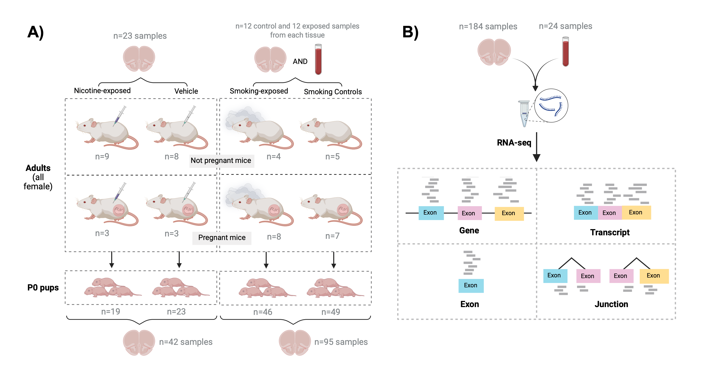

```{r, include = FALSE}
knitr::opts_chunk$set(
    collapse = TRUE,
    comment = "#>"
)
```


```{r vignetteSetup, echo=FALSE, message=FALSE, warning = FALSE}
## Track time spent on making the vignette
startTime <- Sys.time()

## Bib setup
library("RefManageR")

## Write bibliography information
bib <- c(
    R = citation(),
    AnnotationHubData = citation("AnnotationHubData")[1],
    ExperimentHub = citation("ExperimentHub")[1],
    BiocStyle = citation("BiocStyle")[1],
    knitr = citation("knitr")[1],
    RefManageR = citation("RefManageR")[1],
    rmarkdown = citation("rmarkdown")[1],
    sessioninfo = citation("sessioninfo")[1],
    testthat = citation("testthat")[1]
)
```

# Introduction

Welcome to the `smokingMouse` project.
In this vignette we'll show you how to access the smoking-nicotine-mouse LIBD datasets.
You can find the analysis code and the data generation in [here](https://github.com/LieberInstitute/smoking-nicotine-mouse/).

## Motivation 
The main motivation to create this Bioconductor package was to provide public and free access to all RNA-seq datasets that were generated for the smoking-nicotine-mouse project, containing variables of interest that make it possible to answer a wide range of biological questions related to smoking and nicotine effects in mice. 


## Overview
This bulk RNA-sequencing project consisted of a differential expression analysis (DEA) involving 4 data types: genes, exons, transcripts and exon-exon junctions. The main goal of this study was to explore the effects of prenatal exposures to smoking and nicotine on the developing mouse brain. As secondary objectives, this work evaluated: 1) the affected genes by each exposure on the adult female brain in order to compare offspring and adult results and 2) the effects of smoking on adult blood and brain to search for overlapping biomarkers in both tissues. Finally, DEGs identified in mice were compared against previously published results in human (Semick et al. 2020 and Toikumo et al. 2023).

## Study design

<figure>
  
  <figcaption style="color: gray; line-height: 0.88; text-align: justify"><font size="-1.5"><b>Experimental design of the study</b>. <b>A)</b> 21 pregnant mice and 26 nonpregnant female adults were either administered nicotine (n=12), exposed to cigarette smoke (n=12), or used as controls (n=23; 11 nicotine controls and 12 smoking controls). A total of 137 pups were born to pregnant mice: 19 were born to mice that were administered nicotine, 46 to mice exposed to smoking, and the remaining 72 to control mice (23 to nicotine controls and 49 to smoking controls). Frontal cortex samples of all P0 pups (n=137: 42 of nicotine and 95 of the smoking experiment) and adults (n=47: 23 of nicotine and 24 of the smoking experiment) were obtained, as well as blood samples from the smoking-exposed and smoking control adults (n=24), totaling 208 samples. Number of donors and samples are indicated in the figure. <b>B)</b> RNA was extracted from such samples and bulk RNA-seq experiments were performed, obtaining expression counts for genes, exons, transcripts and exon-exon junctions.
  
  </font> 

 </figcaption>
</figure>

# Workflow 

The next table summarizes the analyses done at each level.

<figure>
  
  <figcaption style="color: gray; line-height: 0.94; text-align: justify"><font size="-1.5"><b> Summary of analysis steps across gene expression feature levels</b>:  
  
  <b>1. Data processing</b>: counts of genes, exons, and exon-exon junctions were normalized to CPM and log2-transformed; transcript expression values were only log2-scaled since they were already in TPM. Lowly-expressed features were removed using the indicated functions and samples were separated by tissue and age in order to create subsets of the data for downstream analyses. 
  
  <b>2. Exploratory Data Analysis (EDA)</b>: QC metrics of the samples were examined and used to filter the poor quality ones. Sample level effects were explored through dimensionality reduction methods and segregated samples in PCA plots were removed from the datasets. Gene level effects were evaluated with analyses of variance partition. 
  
  <b>3. Differential Expression Analysis (DEA)</b>: with the relevant variables identified in the previous steps, the DEA was performed at the gene level for nicotine and smoking experiments in adult and pup brain samples, and for smoking in adult blood samples; DEA at the rest of the levels was performed for both exposures in pup brain only. DE signals of the genes in the different conditions, ages, tissues and species (human results from $^1$[Semick et al. 2020](https://www.nature.com/articles/s41380-018-0223-1)) were contrasted, as well as the DE signals of exons and transcripts vs those of their genes. We also analyzed the mean expression of significant and non-significant genes with and without DE features. Then, all resultant DEGs and DE features (and their genes) were compared by direction of regulation (up or down) between and within experiments (nicotine/smoking); mouse DEGs were also compared against human genes associated with TUD from $^2$[Toikumo et al. 2023](https://www.medrxiv.org/content/10.1101/2023.03.27.23287713v2). 
  
  <b>4. Functional Enrichment Analysis</b>: we obtained the GO & KEGG terms significantly enriched in our clusters of DEGs and genes of DE transcripts and exons.
  
  <b>5.  DGE visualization</b>:  the log2-normalized expression of DEGs was represented in heatmaps in order to distinguish the groups of up and downregulated genes.
  
  <b>6. Novel junction gene annotation</b>: for uncharacterized DE junctions with no annotated gene, their nearest, preceding and following genes were determined.
  </font> 
  
<font size="0.8">Abbreviations: Jxn: junction; Tx(s): transcript(s); CPM: counts per million; TPM: transcripts per million; TMM: Trimmed Mean of M-Values; TMMwsp: TMM with singleton pairing; QC: quality control; PC: principal component; DEA: differential expression analysis; DE: differential expression/differentially expressed; FC: fold-change; FDR: false discovery rate; DEGs: differentially expressed genes; TUD: tobacco use disorder; DGE: differential gene expression. </font>

 </figcaption>
</figure>

All `R` scripts created to perform such analyses can be found in [code on GitHub](https://github.com/LieberInstitute/smoking-nicotine-mouse/).


# Basics

## Install `smokingMouse`

`R` is an open-source statistical environment which can be easily modified to enhance its functionality via packages.
`r Biocpkg("smokingMouse")` is an `R` package available via the [Bioconductor](http://bioconductor.org) repository for packages. 
`R` can be installed on any operating system from [CRAN](https://cran.r-project.org/) after which you can install `r Biocpkg("smokingMouse")` by using the following commands in your `R` session:

```{r "install", eval = FALSE}
if (!requireNamespace("BiocManager", quietly = TRUE)) {
    install.packages("BiocManager")
}

BiocManager::install("smokingMouse")

## Check that you have a valid Bioconductor installation
BiocManager::valid()
```

## Required knowledge

`r Biocpkg("smokingMouse")` is based on many other packages and in particular in those that have implemented the infrastructure needed for dealing with RNA-seq data and differential expression. 
That is, packages like `r Biocpkg("SummarizedExperiment")` and `r Biocpkg("limma")`.

If you are asking yourself the question "Where do I start using Bioconductor?" you might be interested in [this blog post](http://lcolladotor.github.io/2014/10/16/startbioc/#.VkOKbq6rRuU).

## Asking for help

As package developers, we try to explain clearly how to use our packages and in which order to use the functions. But `R` and `Bioconductor` have a steep learning curve so it is critical to learn where to ask for help. 
The blog post quoted above mentions some but we would like to highlight the [Bioconductor support site](https://support.bioconductor.org/) as the main resource for getting help: remember to use the `smokingMouse` tag and check [the older posts](https://support.bioconductor.org/tag/smokingMouse/). 
Other alternatives are available such as creating GitHub issues and tweeting. However, please note that if you want to receive help you should adhere to the [posting guidelines](http://www.bioconductor.org/help/support/posting-guide/). 
It is particularly critical that you provide a small reproducible example and your session information so package developers can track down the source of the error.

## Citing `smokingMouse`

We hope that `r Biocpkg("smokingMouse")` will be useful for your research. Please use the following information to cite the package and the overall approach.

```{r "citation"}
## Citation info
citation("smokingMouse")
```

## Quick start to using `smokingMouse`

To get started, please load the `r Biocpkg('smokingMouse')` package. 

```{r "start", message=FALSE}
library("smokingMouse")
```


# smoking Mouse datasets

The raw expression data were generated by LIBD researchers and are composed of read counts of genes, exons, and exon-exon junctions (jxns), and transcripts-per-million (TPM) of transcripts (txs), across the 208 mice samples (from brain/blood; adults/pups; nicotine-exposed/smoking-exposed/controls). 
The datasets available in this package were generated by Daianna Gonzalez-Padilla. 
The human data were generated in Semick et al. 2018 (DOI: https://doi.org/10.1038/s41380-018-0223-1) and contain the results of a DEA in adult and prenatal human brain samples exposed to cigarette smoke. 


## Description of the datasets

### Mouse datasets: 
* They are 4 `r Biocpkg('RangedSummarizedExperiment')` (RSE) objects that contain feature info in `rowData(RSE)` and sample info in `colData(RSE)`. 
* Raw expression counts (and tpm for txs) can be accessed with `assays(RSE)$counts` and the log-transformed data (log2(cpm + 0.5) for genes, exons, and jxns, and log2(tpm + 0.5) for txs) with `assays(RSE)$logcounts`.

### Human datasets:
* They are two data frames with the DE statistics of human genes for cigarette smoke exposure on prenatal and adult human cortical tissue. 


## Data specifics 

* *'rse_gene_mouse_RNAseq_nic-smo.Rdata'*: (`rse_gene` object) the gene RSE object contains the raw and log-normalized expression data of 55,401 mouse genes across the 208 samples from brains and blood of healthy and nicotine/smoking-exposed pup and adult mice. 
* *'rse_tx_mouse_RNAseq_nic-smo.Rdata'*: (`rse_tx` object) the tx RSE object contains the raw and log-scaled expression data of 142,604 mouse transcripts across the 208 samples from brains and blood of healthy and nicotine/smoking-exposed pup and adult mice. 
* *'rse_exon_mouse_RNAseq_nic-smo.Rdata'*: (`rse_exon` object) the exon RSE object contains the raw and log-normalized expression data of 447,670 mouse exons across the 208 samples from brains and blood of healthy and nicotine/smoking-exposed pup and adult mice. 
* *'rse_jx_mouse_RNAseq_nic-smo.Rdata'*: (`rse_jx` object) the jx RSE object contains the raw and log-normalized expression data of 1,436,068 mouse exon-exon junctions across the 208 samples from brains and blood of healthy and nicotine/smoking-exposed pup and adult mice. 

All the above datasets contain the sample and feature metadata and additional data of the results obtained in the filtering steps and the DEA.

* *'de_genes_prenatal_human_brain_smoking.Rdata'*: (`de_genes_prenatal_human_brain_smoking` object) data frame with DE statistics of 18,067 human genes for cigarette smoke exposure in prenatal human cortical tissue. 
* *'de_genes_adult_human_brain_smoking.Rdata'*: (`de_genes_adult_human_brain_smoking` object) data frame with DE statistics of 18,067 human genes for cigarette smoke exposure in adult human cortical tissue.


## Variables of mice data

Feature information in `rowData(RSE)` contains the following variables:

* `retained_after_feature_filtering`: Boolean variable that equals TRUE if the feature passed the feature filtering based on expression levels and FALSE if not. Check code for the feature filtering analysis in [here](https://github.com/LieberInstitute/smoking-nicotine-mouse/blob/main/code/02_build_objects/02_build_objects.R).
* `DE_in_adult_brain_nicotine`: Boolean variable that equals TRUE if the feature is differentially expressed (DE) in adult brain samples exposed to nicotine and FALSE if not. Check code for the DEA in [here](https://github.com/LieberInstitute/smoking-nicotine-mouse/tree/main/code/04_DEA).
* `DE_in_adult_brain_smoking`: Boolean variable that equals TRUE if the feature is differentially expressed (DE) in adult brain samples exposed to cigarette smoke and FALSE if not. Check code for the DEA in [here](https://github.com/LieberInstitute/smoking-nicotine-mouse/tree/main/code/04_DEA).
* `DE_in_adult_blood_smoking`: Boolean variable that equals TRUE if the feature is differentially expressed (DE) in adult blood samples exposed to cigarette smoke and FALSE if not. Check code for the DEA in [here](https://github.com/LieberInstitute/smoking-nicotine-mouse/tree/main/code/04_DEA).
* `DE_in_pup_brain_nicotine`: Boolean variable that equals TRUE if the feature is differentially expressed (DE) in pup brain samples exposed to nicotine and FALSE if not. Check code for the DEA in [here](https://github.com/LieberInstitute/smoking-nicotine-mouse/tree/main/code/04_DEA).
* `DE_in_pup_brain_smoking`: Boolean variable that equals TRUE if the feature is differentially expressed (DE) in pup brain samples exposed to cigarette smoke and FALSE if not. Check code for the DEA in [here](https://github.com/LieberInstitute/smoking-nicotine-mouse/tree/main/code/04_DEA).

The rest of the variables are outputs of the *SPEAQeasy* pipeline (Eagles et al. 2021). See [here](http://research.libd.org/SPEAQeasy/outputs.html) for their description. 

Sample information in `colData(RSE)` contains the following variables:

* The Quality Control (QC) variables `sum`,`detected`,`subsets_Mito_sum`, `subsets_Mito_detected`, `subsets_Mito_percent`, `subsets_Ribo_sum`,`subsets_Ribo_detected` and `subsets_Ribo_percent` are returned by `addPerCellQC()` from *scuttle*. See [here](https://rdrr.io/bioc/scuttle/man/addPerCellQC.html) for more details.
* `retained_after_QC_sample_filtering`: Boolean variable that equals TRUE if the sample passed the sample filtering based on QC metrics and FALSE if not. Check code for QC-based sample filtering in [here](https://github.com/LieberInstitute/smoking-nicotine-mouse/blob/main/code/03_EDA/02_QC.R).
* `retained_after_manual_sample_filtering`: Boolean variable that equals TRUE if the sample passed the manual sample filtering based on PCA plots and FALSE if not. Check code for PCA-based sample filtering in [here](https://github.com/LieberInstitute/smoking-nicotine-mouse/blob/main/code/03_EDA/03_PCA_MDS.R)

The rest of the variables are outputs of *SPEAQeasy*. See their description [here](http://research.libd.org/SPEAQeasy/outputs.html). 

## Variables of human data

Check [Smoking_DLPFC_Devel code](https://github.com/LieberInstitute/Smoking_DLPFC_Devel) for human data generation and `r Biocpkg('limma')` documentation for the description of differential expression statistics.


## Downloading the data with `smokingMouse`

Using `r Biocpkg('smokingMouse')` `r Citep(bib[['smokingMouse']])` you can download these `R` objects. They are hosted by [Bioconductor](http://bioconductor.org/)'s `r Biocpkg('ExperimentHub')` `r Citep(bib[['ExperimentHub']])` resource.
Below you can see how to obtain these objects.

```{r 'experiment_hub'}
## Load ExperimentHub for downloading the data
library("ExperimentHub")

## Connect to ExperimentHub
ehub <- ExperimentHub::ExperimentHub()

## Load the datasets of the package
myfiles <- query(ehub, "smokingMouse")

## Resulting smokingMouse files from our ExperimentHub query
myfiles
```

```{r 'download_data'}
## Load SummarizedExperiment which defines the class container for the data
library("SummarizedExperiment")

######################
#     Mouse data 
######################
myfiles["EH8313"]

## Download the mouse gene data
#  EH8313 | rse_gene_mouse_RNAseq_nic-smo
rse_gene <- myfiles[["EH8313"]]

## This is a RangedSummarizedExperiment object
rse_gene

## Optionally check the memory size
# lobstr::obj_size(rse_gene)
# 159.68 MB

## Check sample info 
head(colData(rse_gene), 3)

## Check gene info
head(rowData(rse_gene), 3)

## Access the original counts
class(assays(rse_gene)$counts)
dim(assays(rse_gene)$counts)
assays(rse_gene)$counts[1:3, 1:3]

## Access the log-normalized counts
class(assays(rse_gene)$logcounts)
assays(rse_gene)$logcounts[1:3, 1:3]


######################
#     Human data 
######################
myfiles["EH8318"]

## Download the human gene data
# EH8318 | de_genes_adult_human_brain_smoking
de_genes_prenatal_human_brain_smoking <- myfiles[["EH8318"]]

## This is a GRanges object
class(de_genes_prenatal_human_brain_smoking)
de_genes_prenatal_human_brain_smoking

## Optionally check the memory size
# lobstr::obj_size(de_genes_prenatal_human_brain_smoking)
# 3.73 MB

## Access data of human genes as normally do with other GenomicRanges::GRanges()
## objects or re-cast it as a data.frame
de_genes_df <- as.data.frame(de_genes_prenatal_human_brain_smoking)
head(de_genes_df)
```


# Reproducibility

The `r Biocpkg("smokingMouse")` package `r Citep(bib[["smokingMouse"]])` and the [study analyses](https://github.com/LieberInstitute/smoking-nicotine-mouse/) were made possible thanks to:

* `R` `r Citep(bib[["R"]])`
* `r Biocpkg("BiocStyle")` `r Citep(bib[["BiocStyle"]])`
* `r CRANpkg("knitr")` `r Citep(bib[["knitr"]])`
* `r CRANpkg("RefManageR")` `r Citep(bib[["RefManageR"]])`
* `r CRANpkg("rmarkdown")` `r Citep(bib[["rmarkdown"]])`
* `r CRANpkg("sessioninfo")` `r Citep(bib[["sessioninfo"]])`
* `r CRANpkg("testthat")` `r Citep(bib[["testthat"]])`
* `r Biocpkg('AnnotationHub')` `r Citep(bib[['AnnotationHub']])`
* `r CRANpkg('cowplot')` `r Citep(bib[['cowplot']])`
* `r Biocpkg('edgeR')` `r Citep(bib[['edgeR']])`
* `r Biocpkg('ExperimentHub')` `r Citep(bib[['ExperimentHub']])`
* `r CRANpkg("jaffelab")` `r Citep(bib[["jaffelab"]])`
* `r Biocpkg('SummarizedExperiment')` `r Citep(bib[['SummarizedExperiment']])`
* `r CRANpkg('ggplot2')` `r Citep(bib[['ggplot2']])`
* `r CRANpkg('ggrepel')` `r Citep(bib[['ggrepel']])`
* `r Biocpkg('scater')` `r Citep(bib[['scater']])`
* `r CRANpkg('rlang')` `r Citep(bib[['rlang']])`
* `r CRANpkg('gridExtra')` `r Citep(bib[['gridExtra']])`
* `r Biocpkg('variancePartition')` `r Citep(bib[['variancePartition']])`
* `r Biocpkg('limma')` `r Citep(bib[['limma']])`
* `r CRANpkg('VennDiagram')` `r Citep(bib[['VennDiagram']])`
* `r CRANpkg('biomartr')` `r Citep(bib[['biomartr']])`
* `r CRANpkg('Hmisc')` `r Citep(bib[['Hmisc']])`
* `r CRANpkg('R.utils')` `r Citep(bib[['R.utils']])`
* `r Biocpkg('clusterProfiler')` `r Citep(bib[['clusterProfiler']])`
* `r Biocpkg('org.Mm.eg.db')` `r Citep(bib[['org.Mm.eg.db']])`
* `r CRANpkg('pheatmap')` `r Citep(bib[['pheatmap']])`
* `r Biocpkg('GenomicRanges')` `r Citep(bib[['GenomicRanges']])`
* `r Biocpkg('rtracklayer')` `r Citep(bib[['rtracklayer']])`

This package was developed using `r BiocStyle::Biocpkg("biocthis")`.

Date the vignette was generated.

```{r reproduce1, echo=FALSE}
## Date the vignette was generated
Sys.time()
```

Wallclock time spent generating the vignette.

```{r reproduce2, echo=FALSE}
## Processing time in seconds
totalTime <- diff(c(startTime, Sys.time()))
round(totalTime, digits = 3)
```

`R` session information.

```{r reproduce3, echo=FALSE}
## Session info
library("sessioninfo")
options(width = 120)
session_info()
```


# Bibliography

This vignette was generated using `r Biocpkg("BiocStyle")` `r Citep(bib[["BiocStyle"]])`
with `r CRANpkg("knitr")` `r Citep(bib[["knitr"]])` and `r CRANpkg("rmarkdown")` `r Citep(bib[["rmarkdown"]])` running behind the scenes.

Citations made with `r CRANpkg("RefManageR")` `r Citep(bib[["RefManageR"]])`.

```{r vignetteBiblio, results = "asis", echo = FALSE, warning = FALSE, message = FALSE}
## Print bibliography
PrintBibliography(bib, .opts = list(hyperlink = "to.doc", style = "html"))
```
